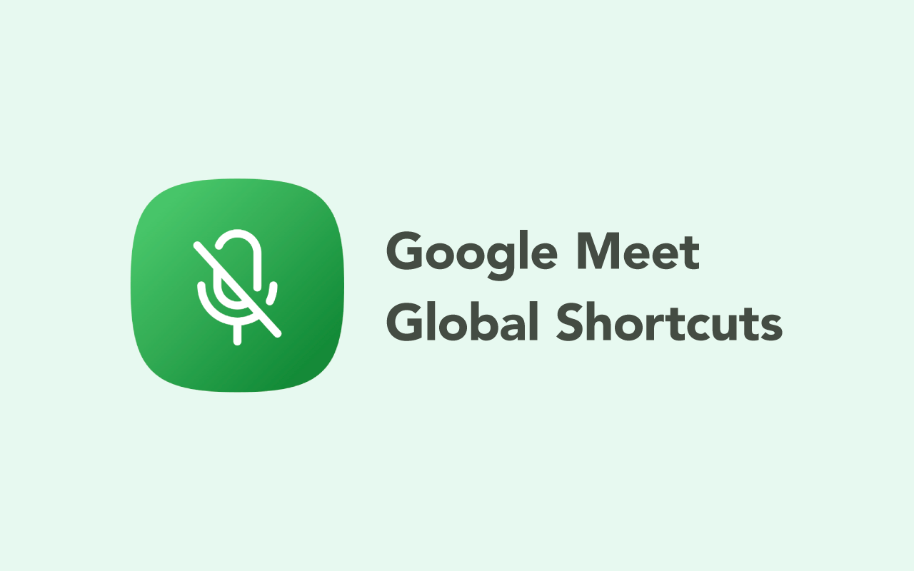

# Google Meet - Global Shortcuts

Chrome Extension which provides shortcuts for turning on/off microphone/camera in Google Meet meetings even when you're in other tabs

Get it via [Chrome Web Store](https://chromewebstore.google.com/detail/google-meet-global-shortc/jdkiffhdknhmflombljefcdcolcbbihb)

## Usage

### Default shortcut keys

Default Shortcut|Operation
---|---
`Ctrl+Shift+D` (`Option+Shift+D` in macOS)|Turn on/off microphone
`Ctrl+Shift+E` (`Option+Shift+E` in macOS)|Turn on/off camera
N/A|Open Meet tab

### Shortcut keys customization

Open Extensions settings of Chrome (`chrome://extensions/`) and click `Keyboard shortcuts` in the side menu.

## Credit

Icon generator: [IconKitchen](https://icon.kitchen/i/H4sIAAAAAAAAAzWPvW7DMAyE34VdPTR%2Fbeq1Q9cCzVYUBS1RMhHJdGQpQRD43UM5yEISH4934A3OGApN0N7AYjoeeooEbU6FGnD%2BM%2FCIKdftRNrAksMSMjTARgYFkc2%2FOAdzA50%2FXEc9Bp%2FQMg1V1fmfHhc4nQonE2iBX0%2BFGhsJklaqeNnuze7tQwULWle02uxx864IB6%2B37XanQe4ZxBF9NXT%2BG63lwVe%2FLCO069cGEvteE%2BrYSc4SH3Mgt9BZnaLYEur3vxpgk7Ctn8mk9UId%2FM133r9j%2FSABAAA%3D)

<!--
icon svg

<svg xmlns="http://www.w3.org/2000/svg" width="32" height="32" viewBox="0 0 256 256"><path fill='#fff' d="m213.92 218.62-160-176a8 8 0 0 0-11.84 10.76L80 95.09V128a48 48 0 0 0 69.11 43.12l11.1 12.2A63.41 63.41 0 0 1 128 192a64.07 64.07 0 0 1-64-64 8 8 0 0 0-16 0 80.11 80.11 0 0 0 72 79.6V240a8 8 0 0 0 16 0v-32.41a78.83 78.83 0 0 0 35.16-12.22l30.92 34a8 8 0 1 0 11.84-10.76ZM128 160a32 32 0 0 1-32-32v-15.31l41.66 45.82A32 32 0 0 1 128 160Zm57.52-3.91A63.32 63.32 0 0 0 192 128a8 8 0 0 1 16 0 79.16 79.16 0 0 1-8.11 35.12 8 8 0 0 1-7.19 4.49 7.88 7.88 0 0 1-3.51-.82 8 8 0 0 1-3.67-10.7ZM84 44.87A48 48 0 0 1 176 64v64a49.19 49.19 0 0 1-.26 5 8 8 0 0 1-8 7.17 8.13 8.13 0 0 1-.84 0 8 8 0 0 1-7.12-8.79c.11-1.1.17-2.24.17-3.36V64a32 32 0 0 0-61.31-12.75A8 8 0 1 1 84 44.87Z"/></svg>
-->
